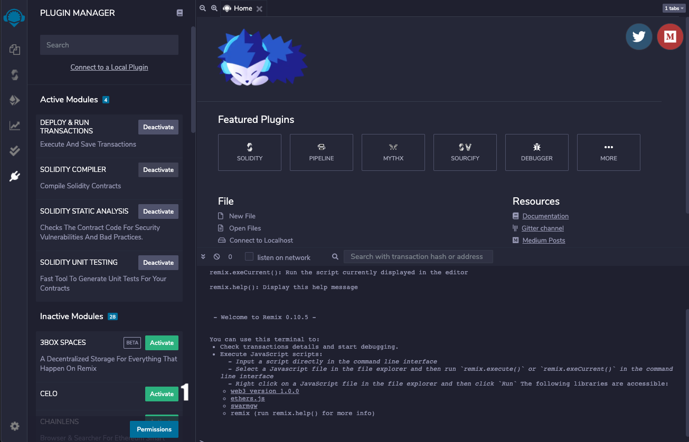
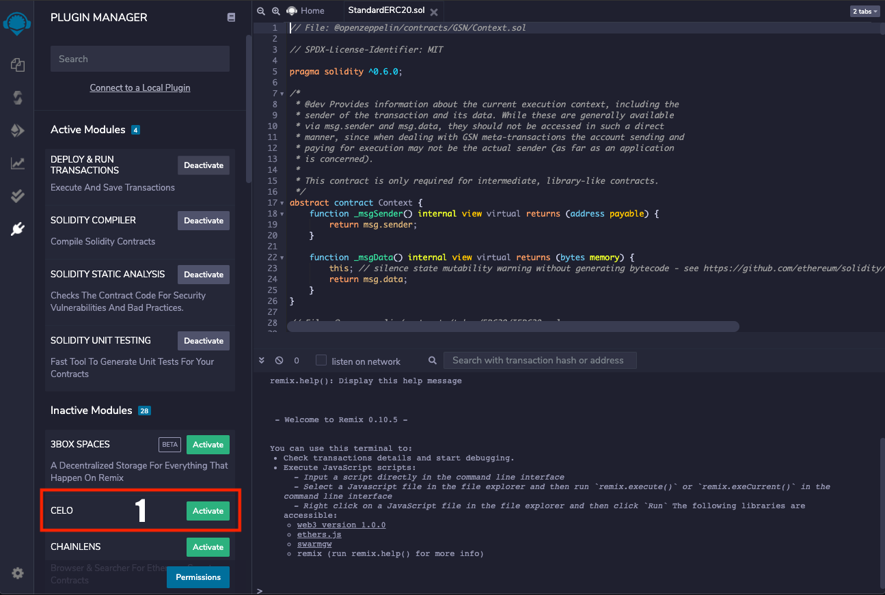

# Celo Plugin for Remix

The Celo plugin for Ethereum's Remix IDE. It support for deploy and interacting on a Celo network.

# Getting Started
1. Click RemixIDE Plugin Manager Icon and activate Celo Plugin

2. Click Celo Plugin Icon

3. Compile your smart contract
4. Connect MetaMask Wallet Account
5. Select Network
6. Select Contract to deploy
7. Deploy

# Scripts

In the project directory, you can run:

## `yarn start`

Runs the app in the development mode. 
Open [http://localhost:3000](http://localhost:3000) to view it in the browser.

The page will reload if you make edits. 
You will also see any lint errors in the console.
